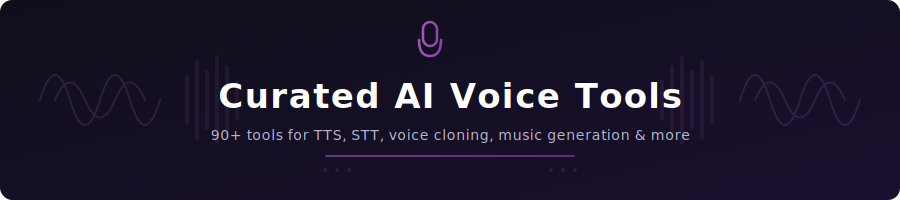

  

<h1 align="center">Curated AI Voice Tools</h1>

  A curated list of AI voice tools -- text-to-speech, speech-to-text, voice cloning, music generation, and audio AI.

  
  
  
  

  
  
  
  

---

## Featured

> **[Ssemble](https://www.ssemble.com/)** - AI-powered video editing platform with advanced audio tools, automatic captioning, text-to-speech, and short-form video creation. Create professional video content with integrated AI voice and audio features. (Commercial)

---

## Table of Contents

- [Text-to-Speech (TTS)](#text-to-speech-tts)
- [Speech-to-Text (STT)](#speech-to-text-stt)
- [Voice Cloning](#voice-cloning)
- [AI Music Generation](#ai-music-generation)
- [Audio Enhancement](#audio-enhancement)
- [Voice Assistants & APIs](#voice-assistants--apis)
- [Podcast & Audio Tools](#podcast--audio-tools)
- [Sound Effects & Foley](#sound-effects--foley)
- [Real-time Voice](#real-time-voice)
- [Contributing](#contributing)
- [License](#license)

---

## Text-to-Speech (TTS)

Tools that convert text into natural-sounding speech using AI.

- **[ElevenLabs](https://elevenlabs.io/)** - Industry-leading AI voice synthesis with ultra-realistic voices, voice cloning, and multilingual support. (Commercial / Freemium)
- **[OpenAI TTS](https://platform.openai.com/docs/guides/text-to-speech)** - High-quality text-to-speech API from OpenAI with six natural-sounding voices and two model variants. (Commercial)
- **[Google Cloud Text-to-Speech](https://cloud.google.com/text-to-speech)** - Google's neural network-powered TTS with 220+ voices across 40+ languages. (Commercial / Free Tier)
- **[Amazon Polly](https://aws.amazon.com/polly/)** - AWS service that turns text into lifelike speech with neural and standard voices in dozens of languages. (Commercial / Free Tier)
- **[Azure AI Speech](https://azure.microsoft.com/en-us/products/ai-services/text-to-speech)** - Microsoft's speech service with 400+ neural voices, custom voice creation, and SSML support. (Commercial / Free Tier)
- **[Coqui TTS](https://github.com/coqui-ai/TTS)** - Deep learning toolkit for text-to-speech, with pretrained models in 1100+ languages. (Open Source)
- **[Bark](https://github.com/suno-ai/bark)** - Transformer-based text-to-audio model that can generate realistic speech, music, and sound effects. (Open Source)
- **[XTTS](https://github.com/coqui-ai/TTS)** - Cross-lingual text-to-speech model supporting voice cloning with just a 6-second sample in 17 languages. (Open Source)
- **[Piper](https://github.com/rhasspy/piper)** - Fast, local neural text-to-speech system optimized for Raspberry Pi and edge devices. (Open Source)
- **[MeloTTS](https://github.com/myshell-ai/MeloTTS)** - High-quality multi-lingual text-to-speech from MyShell, supporting English, Chinese, Japanese, and Korean. (Open Source)
- **[StyleTTS 2](https://github.com/yl4579/StyleTTS2)** - Human-level TTS through style diffusion and adversarial training with large speech language models. (Open Source)
- **[MetaVoice](https://github.com/metavoiceio/metavoice-src)** - Foundational model for human-like, expressive TTS with zero-shot voice cloning. (Open Source)
- **[Parler-TTS](https://github.com/huggingface/parler-tts)** - Lightweight text-to-speech model from Hugging Face that generates high-quality speech in the style of a given speaker using a text description. (Open Source)
- **[Fish Speech](https://github.com/fishaudio/fish-speech)** - Multi-lingual text-to-speech with voice cloning, supporting English, Chinese, Japanese, Korean, and more. (Open Source)
- **[CosyVoice](https://github.com/FunAudioLLM/CosyVoice)** - Multi-lingual large voice generation model by Alibaba for natural speech synthesis, zero-shot voice cloning, and instruction-following capabilities. (Open Source)
- **[Tortoise TTS](https://github.com/neonbjb/tortoise-tts)** - Multi-voice text-to-speech system focused on quality, with voice cloning capabilities. (Open Source)
- **[Cartesia Sonic](https://cartesia.ai/)** - Ultra-low-latency voice generation API with real-time streaming and custom voice creation. (Commercial / Free Tier)

## Speech-to-Text (STT)

Tools that transcribe spoken audio into text using AI.

- **[OpenAI Whisper](https://github.com/openai/whisper)** - Open-source automatic speech recognition model trained on 680,000 hours of multilingual data. (Open Source)
- **[Deepgram](https://deepgram.com/)** - Enterprise speech recognition platform with real-time transcription, high accuracy, and diarization. (Commercial / Free Tier)
- **[AssemblyAI](https://www.assemblyai.com/)** - AI-powered speech-to-text API with speaker diarization, content moderation, and summarization. (Commercial / Free Tier)
- **[Google Cloud Speech-to-Text](https://cloud.google.com/speech-to-text)** - Google's speech recognition supporting 125+ languages with real-time streaming and batch processing. (Commercial / Free Tier)
- **[Azure Speech-to-Text](https://azure.microsoft.com/en-us/products/ai-services/speech-to-text)** - Microsoft's speech recognition with real-time and batch transcription, custom models, and pronunciation assessment. (Commercial / Free Tier)
- **[Speechmatics](https://www.speechmatics.com/)** - Highly accurate speech recognition supporting 50+ languages with real-time and batch processing. (Commercial)
- **[Rev AI](https://www.rev.ai/)** - Speech-to-text API with high accuracy, speaker diarization, and custom vocabulary support. (Commercial / Free Tier)
- **[Gladia](https://www.gladia.io/)** - Enterprise-grade speech-to-text API with real-time transcription, translation, and audio intelligence. (Commercial / Free Tier)
- **[Picovoice Leopard](https://picovoice.ai/platform/leopard/)** - On-device speech-to-text engine for privacy-focused applications running entirely locally. (Commercial / Free Tier)
- **[Faster Whisper](https://github.com/SYSTRAN/faster-whisper)** - Reimplementation of Whisper using CTranslate2, up to 4x faster with the same accuracy. (Open Source)
- **[WhisperX](https://github.com/m-bain/whisperX)** - Enhanced Whisper with word-level timestamps, speaker diarization, and voice activity detection. (Open Source)
- **[Insanely Fast Whisper](https://github.com/Vaibhavs10/insanely-fast-whisper)** - Optimized Whisper inference pipeline achieving near-real-time transcription speeds. (Open Source)
- **[Whisper.cpp](https://github.com/ggerganov/whisper.cpp)** - High-performance C/C++ port of OpenAI Whisper for efficient CPU-based inference. (Open Source)

## Voice Cloning

Tools that replicate a specific voice from audio samples.

- **[ElevenLabs Voice Cloning](https://elevenlabs.io/voice-cloning)** - Professional voice cloning with instant and professional modes using as little as one minute of audio. (Commercial / Freemium)
- **[Resemble AI](https://www.resemble.ai/)** - AI voice generator and cloning platform with real-time synthesis, emotion control, and speech-to-speech. (Commercial)
- **[Descript](https://www.descript.com/)** - All-in-one audio/video editor with AI voice cloning for overdub corrections and content creation. (Commercial / Freemium)
- **[PlayHT](https://play.ht/)** - AI voice generator and text-to-speech platform with voice cloning from just 30 seconds of audio. (Commercial / Freemium)
- **[Coqui XTTS](https://github.com/coqui-ai/TTS)** - Open-source voice cloning supporting 17 languages with just a 6-second reference clip. (Open Source)
- **[RVC (Retrieval-based Voice Conversion)](https://github.com/RVC-Project/Retrieval-based-Voice-Conversion-WebUI)** - Open-source voice conversion framework with a simple web UI for training and inference. (Open Source)
- **[OpenVoice](https://github.com/myshell-ai/OpenVoice)** - Instant voice cloning by MyShell requiring only a short audio clip for voice style, tone, and emotion control. (Open Source)
- **[GPT-SoVITS](https://github.com/RVC-Boss/GPT-SoVITS)** - Few-shot voice cloning and TTS combining GPT and SoVITS models for high-quality results with minimal training data. (Open Source)
- **[Fish Speech](https://github.com/fishaudio/fish-speech)** - Fast and accurate voice cloning supporting multiple languages with zero-shot and few-shot capabilities. (Open Source)
- **[Voice.ai](https://voice.ai/)** - Real-time voice changer and cloner for gaming, streaming, and content creation. (Freemium)
- **[Vall-E X](https://github.com/Plachtaa/VALL-E-X)** - Open-source implementation of the VALL-E neural codec language model for cross-lingual voice cloning. (Open Source)

## AI Music Generation

Tools that compose or generate music using AI models.

- **[Suno](https://suno.com/)** - AI music generation platform that creates full songs with vocals, instruments, and lyrics from text prompts. (Freemium)
- **[Udio](https://www.udio.com/)** - AI music creation tool generating high-quality songs with lyrics and vocals across any genre. (Freemium)
- **[MusicGen](https://github.com/facebookresearch/audiocraft)** - Meta's open-source music generation model that creates music from text descriptions or melody conditioning. (Open Source)
- **[Stable Audio](https://www.stableaudio.com/)** - Stability AI's music and sound generation platform using latent diffusion models. (Commercial / Free Tier)
- **[AIVA](https://www.aiva.ai/)** - AI music composition assistant for creating soundtracks for films, games, and commercials. (Freemium)
- **[Mubert](https://mubert.com/)** - AI-generated royalty-free music for content creators, apps, and businesses. (Freemium)
- **[Soundraw](https://soundraw.io/)** - AI music generator that creates unique, royalty-free music customizable by mood, genre, and length. (Commercial)
- **[Riffusion](https://github.com/riffusion/riffusion)** - Real-time music generation using stable diffusion on spectrograms to create audio from text prompts. (Open Source)
- **[MusicLM](https://google-research.github.io/seanet/musiclm/examples/)** - Google's text-to-music generation model creating high-fidelity music from text descriptions. (Research)
- **[JEN-1](https://www.jenmusic.ai/)** - Universal high-fidelity music generation model with text-guided capabilities. (Research)
- **[Beatoven.ai](https://www.beatoven.ai/)** - AI music generation tool that composes mood-based, royalty-free background music for content. (Freemium)
- **[Loudly](https://www.loudly.com/)** - AI music generator creating royalty-free tracks with customizable arrangement and duration. (Freemium)

## Audio Enhancement

Tools that improve audio quality by removing noise, enhancing clarity, or upscaling.

- **[Adobe Podcast (Enhance Speech)](https://podcast.adobe.com/)** - AI-powered audio enhancement that makes voice recordings sound professionally recorded in a studio. (Free)
- **[Descript Studio Sound](https://www.descript.com/studio-sound)** - One-click audio enhancement that removes background noise and boosts voice quality. (Commercial / Freemium)
- **[Krisp](https://krisp.ai/)** - AI noise cancellation app for calls and recordings that removes background noise, voices, and echo. (Freemium)
- **[NVIDIA Broadcast](https://www.nvidia.com/en-us/geforce/broadcasting/broadcast-app/)** - AI-powered noise removal, room echo removal, and virtual background for streaming and calls. (Free / Requires NVIDIA GPU)
- **[DeepFilterNet](https://github.com/Rikorose/DeepFilterNet)** - Open-source deep learning-based noise suppression for real-time speech enhancement. (Open Source)
- **[Resemble Enhance](https://github.com/resemble-ai/resemble-enhance)** - Open-source AI speech enhancement combining denoising and super-resolution for clearer audio. (Open Source)
- **[AudioSR](https://github.com/haoheliu/versatile_audio_super_resolution)** - Versatile audio super-resolution model that upscales any audio to high-resolution 48kHz. (Open Source)
- **[Audo Studio](https://audo.ai/)** - AI-powered audio cleaning tool that removes noise and enhances speech with one click. (Freemium)
- **[Dolby.io Enhance](https://dolby.io/products/enhance/)** - Professional audio enhancement API for noise reduction, loudness correction, and speech isolation. (Commercial / Free Tier)

## Voice Assistants & APIs

Platforms and APIs for building voice-enabled applications and conversational AI.

- **[Vapi](https://vapi.ai/)** - Platform for building, testing, and deploying AI voice agents with real-time conversation capabilities. (Commercial / Free Tier)
- **[Bland AI](https://www.bland.ai/)** - Enterprise AI phone calling platform for building automated voice agents at scale. (Commercial)
- **[Retell AI](https://www.retellai.com/)** - Build and deploy AI voice agents with natural-sounding conversations and low latency. (Commercial / Free Tier)
- **[Vocode](https://github.com/vocodedev/vocode-core)** - Open-source library for building voice-based AI applications with LLM integration. (Open Source)
- **[Daily](https://www.daily.co/)** - Real-time voice and video infrastructure for building AI-powered communication apps. (Commercial / Free Tier)
- **[LiveKit](https://github.com/livekit/livekit)** - Open-source platform for real-time audio/video communication with built-in AI agent support. (Open Source / Commercial)
- **[Hume AI](https://www.hume.ai/)** - Empathic voice AI API that understands and generates speech with emotional intelligence. (Commercial / Free Tier)
- **[Cartesia](https://cartesia.ai/)** - Ultra-fast voice API with streaming speech synthesis under 100ms latency for real-time applications. (Commercial / Free Tier)
- **[Pipecat](https://github.com/pipecat-ai/pipecat)** - Open-source framework for building voice and multimodal conversational AI agents. (Open Source)
- **[Deepgram Aura](https://deepgram.com/aura)** - Text-to-speech API optimized for real-time AI agent conversations with natural-sounding voices. (Commercial / Free Tier)

## Podcast & Audio Tools

AI-powered tools for podcast production, editing, and distribution.

- **[Descript](https://www.descript.com/)** - All-in-one podcast editor with AI transcription, filler word removal, studio sound, and text-based editing. (Commercial / Freemium)
- **[Riverside](https://riverside.fm/)** - High-quality remote podcast and video recording with AI transcription, editing, and clip generation. (Commercial / Freemium)
- **[Podcastle](https://podcastle.ai/)** - AI-powered podcast creation platform with recording, editing, text-to-speech, and voice cloning. (Freemium)
- **[Adobe Podcast](https://podcast.adobe.com/)** - Web-based podcast recording and editing with AI-powered speech enhancement and transcription. (Free)
- **[Cleanvoice](https://cleanvoice.ai/)** - AI tool that automatically removes filler words, mouth sounds, and stuttering from podcast recordings. (Commercial)
- **[Snipd](https://www.snipd.com/)** - AI-powered podcast player that automatically generates highlights, summaries, and transcripts. (Freemium)
- **[Opus Clip](https://www.opus.pro/)** - AI tool that repurposes long podcasts and videos into viral short-form clips. (Freemium)
- **[Wondercraft](https://www.wondercraft.ai/)** - AI podcast creation tool that turns scripts into fully produced podcast episodes with realistic voices. (Commercial)
- **[Podium](https://hello.podium.page/)** - AI-powered podcast show notes, transcripts, and highlight generators. (Freemium)
- **[Castmagic](https://www.castmagic.io/)** - AI tool that generates transcripts, show notes, summaries, and social posts from podcast audio. (Commercial)

## Sound Effects & Foley

Tools for generating sound effects, foley, and audio textures using AI.

- **[ElevenLabs Sound Effects](https://elevenlabs.io/sound-effects)** - AI sound effect generator that creates custom audio from text descriptions. (Commercial / Freemium)
- **[Stable Audio](https://www.stableaudio.com/)** - Stability AI's model for generating music and sound effects from text prompts. (Commercial / Free Tier)
- **[AudioCraft](https://github.com/facebookresearch/audiocraft)** - Meta's open-source audio generation library including AudioGen for sound effects from text. (Open Source)
- **[Make-An-Audio](https://github.com/Text-to-Audio/Make-An-Audio)** - Text-to-audio generation model creating diverse audio content from text descriptions. (Open Source)
- **[PicoAudio](https://github.com/stanford-crfm/picoaudio)** - Lightweight audio generation model for creating sound effects and audio events. (Open Source)
- **[WavJourney](https://github.com/Audio-AGI/WavJourney)** - Compositional audio creation with large language models that generates complex audio scenes. (Open Source)
- **[Tango](https://github.com/declare-lab/tango)** - Text-to-audio generation model using instruction-tuned LLMs for high-quality sound effects. (Open Source)

## Real-time Voice

Tools for real-time voice modification, conversion, and streaming.

- **[Voice.ai](https://voice.ai/)** - Free real-time voice changer with thousands of user-generated voice filters for gaming and streaming. (Freemium)
- **[Voicemod](https://www.voicemod.net/)** - Real-time AI voice changer and soundboard for gaming, streaming, and communication. (Freemium)
- **[Resemble AI Real-time](https://www.resemble.ai/)** - Real-time speech-to-speech voice conversion with emotion control and low latency. (Commercial)
- **[SpeechT5](https://github.com/microsoft/SpeechT5)** - Microsoft's unified-modal model for speech-text tasks including real-time synthesis and conversion. (Open Source)
- **[Silero Models](https://github.com/snakers4/silero-models)** - Pre-trained speech models for STT, TTS, and voice activity detection optimized for real-time use. (Open Source)
- **[Pipecat](https://github.com/pipecat-ai/pipecat)** - Open-source framework for building real-time voice AI pipelines with transport and model integration. (Open Source)
- **[RVC WebUI](https://github.com/RVC-Project/Retrieval-based-Voice-Conversion-WebUI)** - Real-time voice conversion using retrieval-based methods with a user-friendly web interface. (Open Source)

---

## Contributing

Contributions are welcome! Please read the [contribution guidelines](CONTRIBUTING.md) before submitting a pull request.

If you know of an AI voice tool that should be on this list, please open a PR or [submit an issue](https://github.com/awesome-ai-tools/curated-ai-voice-tools/issues/new?template=tool-suggestion.yml).

## License

[MIT](LICENSE) - Copyright (c) 2025 Awesome AI Tools
